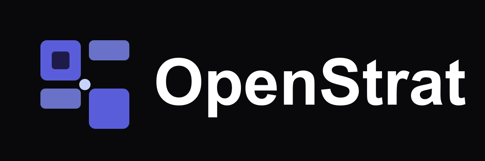

# OpenStrat

<p align="center">
  
</p>

> Dashboard de gestion d'agents et de skills pour projets IA avec OpenCode.

## 🚀 Installation rapide (première fois)

```bash
curl -fsSL https://raw.githubusercontent.com/benskls/openstrat/main/install.sh | bash
```

Le script va :
1. Vérifier Node.js
2. Demander où placer vos projets
3. Installer OpenStrat
4. Créer un alias `openstrat` dans votre shell
5. Lancer le dashboard sur http://localhost:3456

## 📂 Structure recommandée

```
~/projets/                    ← dossier racine (configurable)
├── openstrat/                ← ce dashboard
│   ├── server.js
│   └── public/
├── altuas/                   ← vos projets OpenCode
├── mon-projet/
└── autre-projet/
```

## 🎯 Fonctionnalités

| Vue | Description |
|-----|-------------|
| **Agents** | Hiérarchie Primary/Subagent alignée sur le modèle OpenCode |
| **Skills** | Bibliothèque de skills avec édition inline |
| **Picture** | Visualisation stratégique (phases, jalons, trajectoire) |
| **Progress** | Suivi des tâches et recommandations |
| **Roadmap** | Matrix Picture × Progress pour voir l'alignement stratégique |
| **Multi-projets** | Switch rapide entre projets via le sélecteur |
| **Dossier racine configurable** | Choisissez où scanner vos projets |
| **Génération automatique de templates** | Créez agents, skills, picture, progress, roadmap en un clic |
| **Empty states avec CTA** | Interface guidée quand un projet est vide |
| **Compteurs temps réel** | Nombre d'agents, skills et fichiers détectés |
| **Refresh du dossier racine** | Rescan à la volée pour détecter les nouveaux projets |

## 🛠 Utilisation

### Lancer le dashboard

```bash
openstrat    # alias créé par install.sh
```

Ou manuellement :

```bash
cd /chemin/vers/openstrat
npm start
```

### Créer un nouveau projet

1. Créez un dossier vide dans votre dossier racine :
   ```bash
   mkdir ~/projets/mon-projet
   ```
2. Ouvrez http://localhost:3456
3. Cliquez sur 🔄 pour scanner
4. Sélectionnez `mon-projet`
5. Générez vos fichiers dans chaque onglet :
   - **Agents** → "Créer l'agent principal"
   - **Skills** → "Créer les skills de session"
   - **Picture** → "Créer la Picture"
   - **Progress** → "Créer le Progress"
   - **Roadmap** → "Créer la Roadmap"

### Configurer le dossier racine

Dans le sidebar, section "Dossier racine" :
- 🔄 **Refresh** : rescanner le dossier (détecte nouveaux projets)
- **Configurer** : changer le chemin absolu du dossier scanné

### Éditer des fichiers

- Cliquez sur un agent/skill pour l'ouvrir dans l'éditeur
- Modifiez le markdown
- Sauvegardez avec `Cmd+S` ou le bouton Save

## 📁 Stack

- **Backend** : Express.js, détection multi-projets
- **Frontend** : Vanilla HTML/CSS/JS, Tailwind CDN
- **Parsing** : Marked.js pour le rendu Markdown

## 📝 Templates générés

Pour chaque projet, OpenStrat peut générer :

| Fichier | Emplacement | Rôle |
|---------|-------------|------|
| `{projet}-main.md` | `.opencode/agents/` | Agent principal orchestrateur |
| `{projet}-session-start/SKILL.md` | `.opencode/skills/` | Skill de démarrage de session |
| `{projet}-session-end/SKILL.md` | `.opencode/skills/` | Skill de clôture de session |
| `PICTURE.md` | `docs/` | Vision stratégique |
| `progress.md` | racine | Suivi d'exécution |
| `roadmap.md` | racine | Trajectoire & jalons |

### Skills de session

Les skills **session-start** et **session-end** sont générés automatiquement pour structurer le rythme de travail sur chaque projet :

- **session-start** : brief d'ouverture — contexte, objectifs de la session, fichiers à consulter
- **session-end** : clôture et récap — ce qui a été fait, prochaines étapes, points de vigilance

## 🔧 Commandes utiles

```bash
openstrat                    # Lancer le dashboard
lsof -ti:3456 | xargs kill   # Arrêter le serveur
cat /tmp/openstrat.log       # Voir les logs
```

## 🏗 Architecture agents/skills

Les agents et skills sont **préfixés par le nom du projet** pour éviter les collisions entre projets :
- `altuas-main.md` (visible uniquement depuis altuas)
- `mon-projet-main.md` (visible uniquement depuis mon-projet)

**Important** : OpenCode Desktop fusionne les configs globales et par projet. Pour isoler les agents, ne placez pas vos agents dans `~/.config/opencode/agents/` (global) — laissez-les dans le dossier `.opencode/agents/` de chaque projet.

---

*Logo et design inspirés de l'écosystème OpenCode.*
